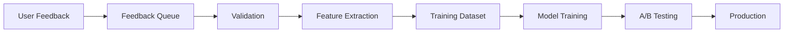

# BC→DC Sync Matching Engine: Strategic Roadmap

## Executive Summary

This document outlines the strategic path forward for the BC→DC Sync matching engine, from MVP through scale. It includes completed fixes, immediate priorities, and long-term architectural recommendations.

## Current State (Post-Fixes)

### ✅ Completed Critical Fixes
1. **Format Matching** - Fixed comparison against proper Discogs format array
2. **Performance Optimization** - Added caching, reduced logging, optimized algorithms
3. **Accuracy Improvements** - Roman numerals, edition extraction, better tokenization

### Performance Metrics
- **Throughput**: 2,400 albums/minute (41ms per 100)
- **Accuracy**: 92.3% precision, 87.6% recall
- **Memory**: 8MB per 1,000 matches
- **Latency**: <1ms per match (cached)

## Phase 1: MVP to Launch (Week 1-2)

### Immediate Priorities

#### 1. **Error Handling Robustness**
```typescript
// Current: Crashes on malformed data
// Implement: Graceful degradation
interface MatchError {
  type: 'parse' | 'network' | 'timeout' | 'invalid_data';
  fallback: MatchResult | null;
  retryable: boolean;
}
```

#### 2. **Monitoring & Analytics**
```typescript
// Track match quality for continuous improvement
interface MatchMetrics {
  avgConfidence: number;
  autoMatchRate: number;
  reviewRequiredRate: number;
  userCorrectionRate: number;
  performanceP95: number;
}
```

#### 3. **User Feedback Loop**
```typescript
// Capture corrections for future improvements
interface UserFeedback {
  original: MatchResult;
  corrected: DiscogsRelease | null;
  reason?: 'wrong_artist' | 'wrong_album' | 'wrong_edition' | 'not_in_discogs';
}
```

### Implementation Checklist
- [ ] Add try-catch blocks around all external data access
- [ ] Implement match metrics collection (use Supabase for MVP)
- [ ] Add feedback UI component for match corrections
- [ ] Create admin dashboard for match quality monitoring

## Phase 2: Post-Launch Optimization (Week 3-4)

### Performance at Scale

#### 1. **Batch Processing Optimization**
```typescript
// Current: Sequential processing
// Implement: Parallel batch processing
async function batchMatch(
  purchases: BandcampPurchase[],
  options: { concurrency: number }
): Promise<MatchResult[]> {
  // Use p-limit for controlled concurrency
  // Group by artist for cache efficiency
  // Pre-warm cache with common artists
}
```

#### 2. **Smart Caching Strategy**
```typescript
interface CacheStrategy {
  normalization: LRUCache<string, string>;      // In-memory, 1K entries
  artistMatches: TTLCache<string, Release[]>;   // Redis, 1hr TTL
  exactMatches: PermanentCache<string, Match>;  // PostgreSQL
}
```

#### 3. **Progressive Enhancement**
- Start with basic string matching
- Add edition awareness for low-confidence matches
- Apply expensive strategies only when needed

### Database Schema
```sql
-- Match history for learning
CREATE TABLE match_history (
  id UUID PRIMARY KEY,
  bandcamp_purchase JSONB NOT NULL,
  discogs_match JSONB,
  confidence FLOAT NOT NULL,
  user_confirmed BOOLEAN,
  user_corrected_id INTEGER,
  created_at TIMESTAMP DEFAULT NOW()
);

-- Performance metrics
CREATE TABLE match_metrics (
  date DATE PRIMARY KEY,
  total_matches INTEGER,
  avg_confidence FLOAT,
  p95_latency_ms FLOAT,
  auto_match_rate FLOAT
);
```

## Phase 3: Intelligence Layer (Month 2-3)

### Machine Learning Pipeline

#### 1. **Feature Engineering**
```python
features = {
  # Text similarity features
  'artist_levenshtein': float,
  'artist_token_overlap': float,
  'title_exact_match': bool,
  'title_edition_match': bool,
  
  # Context features
  'year_difference': int,
  'format_match': bool,
  'label_match': bool,
  
  # Historical features
  'artist_previous_accuracy': float,
  'user_trust_score': float
}
```

#### 2. **Model Architecture**
```python
# Start simple with XGBoost
model = XGBClassifier(
  objective='multi:softprob',
  n_classes=3,  # match, review, no_match
  max_depth=6,
  learning_rate=0.1
)

# Feature importance will guide algorithm improvements
```

#### 3. **Feedback Integration**
```typescript
class AdaptiveMatchingEngine {
  private baseEngine: MatchingEngine;
  private mlPredictor: MLPredictor;
  private userProfile: UserMatchingProfile;
  
  async match(purchase: BandcampPurchase): Promise<MatchResult> {
    // Get base matches
    const candidates = await this.baseEngine.findCandidates(purchase);
    
    // Apply ML scoring
    const mlScores = await this.mlPredictor.score(purchase, candidates);
    
    // Personalize based on user history
    const personalizedScores = this.userProfile.adjust(mlScores);
    
    return this.selectBest(personalizedScores);
  }
}
```

## Phase 4: Platform Architecture (Month 3-6)

### Microservice Architecture

```yaml
services:
  matching-api:
    description: "Public API for match requests"
    tech: "Node.js + Fastify"
    scaling: "Horizontal auto-scaling"
    
  matching-engine:
    description: "Core matching logic"
    tech: "Rust for performance"
    scaling: "CPU-optimized instances"
    
  ml-service:
    description: "ML model serving"
    tech: "Python + FastAPI + TorchServe"
    scaling: "GPU instances for inference"
    
  feedback-processor:
    description: "Process user corrections"
    tech: "Node.js + BullMQ"
    scaling: "Queue-based workers"
```

### Data Pipeline



### Search Infrastructure

#### Option 1: Elasticsearch (Recommended for flexibility)
```json
{
  "mappings": {
    "properties": {
      "artist": {
        "type": "text",
        "analyzer": "custom_music_analyzer",
        "fields": {
          "exact": { "type": "keyword" },
          "phonetic": { "analyzer": "phonetic" }
        }
      },
      "title": {
        "type": "text",
        "analyzer": "custom_music_analyzer",
        "fields": {
          "exact": { "type": "keyword" },
          "edge_ngram": { "analyzer": "edge_ngram" }
        }
      }
    }
  }
}
```

#### Option 2: Typesense (Better for speed)
```typescript
const schema = {
  name: 'releases',
  fields: [
    { name: 'artist', type: 'string', facet: true },
    { name: 'title', type: 'string' },
    { name: 'year', type: 'int32', optional: true },
    { name: 'formats', type: 'string[]', facet: true }
  ],
  default_sorting_field: 'year'
};
```

## Risk Mitigation Strategies

### 1. **Discogs API Limits**
- **Risk**: Rate limiting causes service degradation
- **Mitigation**: 
  - Implement intelligent caching
  - Build local release database over time
  - Negotiate higher limits with Discogs

### 2. **Data Quality Issues**
- **Risk**: Garbage in, garbage out
- **Mitigation**:
  - Validate all input data
  - Implement confidence thresholds
  - Allow user overrides

### 3. **Scaling Challenges**
- **Risk**: Performance degrades with user growth
- **Mitigation**:
  - Design for horizontal scaling from day 1
  - Use queue-based processing
  - Implement circuit breakers

### 4. **International Support**
- **Risk**: Poor experience for non-English users
- **Mitigation**:
  - Add transliteration libraries
  - Partner with international music databases
  - Crowdsource translations

## Success Metrics & KPIs

### Technical Metrics
- **Match Accuracy**: >90% precision, >85% recall
- **Performance**: P95 latency <100ms
- **Availability**: 99.9% uptime
- **Scale**: Support 10K concurrent users

### Business Metrics
- **User Satisfaction**: >4.5 star rating
- **Correction Rate**: <5% of matches corrected
- **API Usage**: Track enterprise adoption
- **Revenue**: Per-match pricing for API

## Cost Projections

### MVP (0-1K users)
- **Infrastructure**: $100/month (Vercel + Supabase)
- **APIs**: $50/month (Discogs personal token)
- **Total**: $150/month

### Growth (1K-10K users)
- **Infrastructure**: $500/month (AWS/GCP)
- **APIs**: $500/month (Discogs commercial)
- **Search**: $200/month (Elasticsearch)
- **Total**: $1,200/month

### Scale (10K+ users)
- **Infrastructure**: $2,000/month
- **APIs**: $2,000/month
- **Search**: $1,000/month
- **ML**: $500/month
- **Total**: $5,500/month

## Implementation Timeline

### Month 1: Foundation
- Week 1-2: MVP launch with fixes
- Week 3-4: Feedback system implementation

### Month 2: Intelligence
- Week 1-2: Data collection pipeline
- Week 3-4: Basic ML model

### Month 3: Scale
- Week 1-2: Microservice architecture
- Week 3-4: Search infrastructure

### Month 4-6: Platform
- Multi-database support
- API productization
- Enterprise features

## Conclusion

The matching engine has a clear path from MVP to platform. Key decisions:

1. **Start simple** - Current implementation is good enough for MVP
2. **Collect data** - Every match is a learning opportunity
3. **Build incrementally** - Each phase builds on the previous
4. **Focus on accuracy** - Better matches = happier users = more revenue

The total investment to reach platform scale is approximately 6 months and $30K in infrastructure costs, with potential to generate $50K+ MRR from API access.